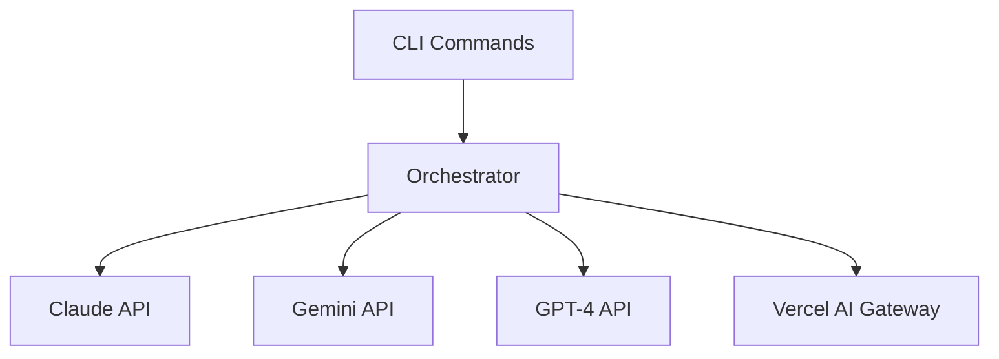
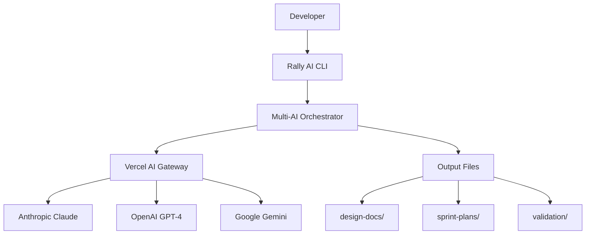
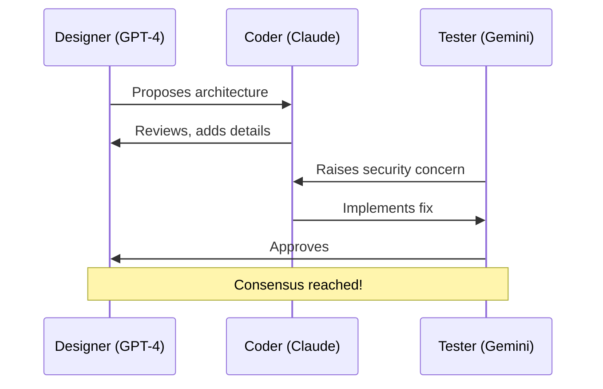

# Rally AI Documentation Audit

**Date:** November 28, 2025
**Auditor:** Doc Agent
**Repository:** `tools/rally-ai/` in aicoderally-stack

---

## Executive Summary

Rally AI has **good foundational documentation** with a comprehensive README and inline code comments. However, there are opportunities to improve developer experience with additional guides, examples, and API documentation.

**Overall Score:** 7.5/10

---

## What Exists (✅)

### 1. README.md - Comprehensive User Guide ✅

**Location:** `tools/rally-ai/README.md`
**Size:** ~500 lines
**Quality:** Excellent

**Coverage:**
- ✅ Overview and architecture
- ✅ Installation instructions
- ✅ Environment variable configuration
- ✅ All commands documented (`collaborate`, `workflow`, `design`, `sprint-plan`, `validate`, `info`)
- ✅ Vercel AI Gateway integration explained in detail
- ✅ AI model roles (Claude, Gemini, GPT-4)
- ✅ Complete workflow examples
- ✅ Output directory structure
- ✅ Development commands

**Strengths:**
- Very thorough command documentation
- Real examples with context
- Excellent Vercel AI Gateway explanation
- Clear workflow examples

**Weaknesses:**
- Could use more visual diagrams
- No FAQ section
- Limited troubleshooting coverage

---

### 2. TESTING_RESULTS.md - Test Documentation ✅

**Location:** `tools/rally-ai/TESTING_RESULTS.md`
**Size:** ~300 lines
**Quality:** Good

**Coverage:**
- ✅ Test summary (ALL TESTS PASSED)
- ✅ Test case: Button component feature
- ✅ Results for each command
- ✅ Files generated examples
- ✅ Performance metrics table
- ✅ Issues encountered & resolutions
- ✅ Recommendations for production

**Strengths:**
- Real test results
- Shows actual output
- Performance metrics
- Production recommendations

**Could Add:**
- More test cases
- Integration test examples
- Error scenario tests

---

### 3. Inline Code Documentation (JSDoc) ✅

**Files Checked:**
- `src/orchestrator.ts` - 12+ JSDoc blocks
- `src/collaboration.ts` - Excellent file header + method docs
- `src/model-router.ts` - Well-documented routing system
- `src/cli.ts` - Command descriptions via Commander.js

**Quality:** Good to Excellent

**Example from collaboration.ts:**
```typescript
/**
 * Multi-Agent Collaboration Framework
 *
 * Enables ChatGPT (Designer), Claude (Coder), and Gemini (Tester) to
 * communicate, iterate, and collaborate on various tasks using different modes.
 */
```

**Example from model-router.ts:**
```typescript
/**
 * Rally AI Model Router
 *
 * Abstraction layer for routing to different AI providers:
 * - Public providers via Vercel AI Gateway (Anthropic, OpenAI, Google)
 * - Private SPM LLaMA service with RAG support
 */
```

**Strengths:**
- File-level documentation explaining purpose
- Type definitions are well-documented
- Clear interface definitions

**Gaps:**
- Not all public methods have JSDoc
- Some complex functions lack detailed comments
- Parameter descriptions could be more detailed

---

### 4. TypeScript Types ✅

**Quality:** Excellent

All major interfaces and types are exported:
- `DesignResult`
- `SprintPlanResult`
- `ValidationResult`
- `WorkflowResult`
- `AgentRole`
- `MessageType`
- `CollaborationState`
- `RallyModelId`

**Strength:** Clear type names that are self-documenting

---

## What's Missing (❌)

### 1. API Reference Documentation ❌

**Gap:** No generated API documentation (e.g., TypeDoc)

**What's Needed:**
- Full API reference with all public methods
- Parameter descriptions
- Return value documentation
- Usage examples for each method
- Error handling documentation

**Impact:** Medium - Developers need to read source code to understand API

**Recommendation:**
```bash
# Add TypeDoc
npm install --save-dev typedoc

# Generate docs
npx typedoc src/orchestrator.ts src/collaboration.ts --out docs/api
```

---

### 2. Examples Directory ❌

**Gap:** No `examples/` directory with real-world use cases

**What's Needed:**
```
examples/
├── basic-design/
│   ├── run.sh
│   └── expected-output/
├── collaboration/
│   ├── run.sh
│   └── expected-output/
├── ci-integration/
│   ├── github-actions.yml
│   └── gitlab-ci.yml
└── custom-agents/
    └── custom-role-config.ts
```

**Impact:** Medium - Developers learn by example

---

### 3. Architecture Diagram ❌

**Gap:** No visual representation of system architecture

**What's Needed:**
- Flow diagram showing multi-AI orchestration
- Component diagram (CLI → Orchestrator → Providers)
- Collaboration sequence diagram
- Model routing diagram

**Impact:** Low - README text is clear, but visuals help

**Recommendation:**
Use Mermaid.js in markdown:
```markdown
## Architecture



---

### 4. CONTRIBUTING.md ❌

**Gap:** No contributor guide

**What's Needed:**
- How to set up development environment
- How to run tests
- Code style guidelines
- How to add a new command
- How to add a new AI provider
- Pull request process

**Impact:** Medium - Important for open source contributions

**Template:**
```markdown
# Contributing to Rally AI

## Development Setup
...

## Adding a New Command
...

## Code Style
...

## Testing
...
```

---

### 5. Comprehensive Troubleshooting Guide ❌

**Gap:** Limited troubleshooting in README

**What's Needed:**
Expand README or create `TROUBLESHOOTING.md`:

```markdown
# Troubleshooting Rally AI

## "API key not found"
...

## "Gateway authentication failed"
...

## "Rate limit exceeded"
...

## "Model not responding"
...
```

**Impact:** Medium - Helps users solve problems faster

---

### 6. FAQ Section ❌

**Gap:** No FAQ in README or separate file

**What's Needed:**
```markdown
## Frequently Asked Questions

### Can I use Rally AI without Vercel AI Gateway?
Yes, set direct provider API keys...

### Which AI model is best for what?
- Claude: Technical analysis...
- Gemini: Business validation...
- GPT-4: Sprint planning...

### How much does Rally AI cost?
...
```

**Impact:** Low - Can be added to README

---

### 7. CHANGELOG.md ❌

**Gap:** No version history or changelog

**What's Needed:**
```markdown
# Changelog

## [1.0.0] - 2025-11-28
### Added
- Multi-agent collaboration
- Vercel AI Gateway integration
...
```

**Impact:** Low initially, High as project evolves

---

## Detailed Recommendations

### Priority 1: API Reference (Medium Effort, High Impact)

**Action:**
1. Install TypeDoc: `npm install --save-dev typedoc`
2. Add JSDoc to all public methods in `orchestrator.ts`
3. Generate API docs: `npx typedoc --out docs/api`
4. Link from README: "See [API Reference](docs/api/)"

**Example JSDoc to add:**
```typescript
/**
 * Run the complete design phase with Claude and Gemini
 *
 * @param feature - Feature name (e.g., "user-authentication")
 * @param context - Additional context for the design
 * @returns Design result with Claude analysis, Gemini validation, and unified design
 * @throws Error if API keys are not configured
 *
 * @example
 * ```typescript
 * const orchestrator = new MultiAIOrchestrator();
 * const result = await orchestrator.design("user-auth", "OAuth + email/password");
 * console.log(result.unifiedDesign);
 * ```
 */
async design(feature: string, context?: string): Promise<DesignResult> {
  // ...
}
```

---

### Priority 2: Examples Directory (Low Effort, High Impact)

**Action:**
Create `examples/` directory with runnable examples:

**Structure:**
```
examples/
├── README.md                    # How to run examples
├── 01-basic-design/
│   ├── run.sh
│   └── README.md
├── 02-collaboration/
│   ├── run.sh
│   └── README.md
├── 03-full-workflow/
│   ├── run.sh
│   └── README.md
└── 04-ci-integration/
    ├── github-action.yml
    └── README.md
```

**Example run.sh:**
```bash
#!/bin/bash
# Example: Basic design workflow

echo "Running Rally AI design for 'user-profile' feature..."

rally-ai design "user-profile" \
  --context "User profile page with avatar, bio, and settings"

echo "Design complete! Check design-docs/"
```

---

### Priority 3: Architecture Diagrams (Low Effort, Medium Impact)

**Action:**
Add Mermaid diagrams to README.md:

**System Architecture:**


**Collaboration Flow:**


---

### Priority 4: CONTRIBUTING.md (Medium Effort, Medium Impact)

**Action:**
Create `CONTRIBUTING.md`:

```markdown
# Contributing to Rally AI

## Development Setup

1. Clone the repository
2. Install dependencies: `pnpm install`
3. Set up environment variables (see README)
4. Run in dev mode: `pnpm dev design "test-feature"`

## Adding a New Command

1. Add command definition in `src/cli.ts`
2. Add orchestrator method in `src/orchestrator.ts`
3. Add JSDoc documentation
4. Update README.md
5. Add example in `examples/`
6. Add test case

## Code Style

- Use TypeScript strict mode
- Add JSDoc for all public methods
- Follow existing naming conventions
- Run `pnpm typecheck` before committing

## Testing

Currently manual testing. Automated tests coming soon.

## Pull Request Process

1. Create feature branch
2. Make changes
3. Update documentation
4. Submit PR with clear description
```

---

### Priority 5: Enhanced Troubleshooting (Low Effort, Medium Impact)

**Action:**
Add to README or create `TROUBLESHOOTING.md`:

```markdown
# Troubleshooting

## "Command not found: rally-ai"

**Solution:**
```bash
# Option 1: Run via pnpm
cd tools/rally-ai
pnpm dev design "feature"

# Option 2: Build and add to PATH
pnpm build
export PATH="$PATH:$(pwd)"
```

## "API key not found"

**Check environment variables:**
```bash
echo $ANTHROPIC_API_KEY
echo $OPENAI_API_KEY
echo $GOOGLE_API_KEY
```

**Set if missing:**
```bash
export ANTHROPIC_API_KEY="sk-ant-..."
```

## "Gateway authentication failed"

**Refresh OIDC token (expires every 12 hours):**
```bash
vercel env pull
```

## "Rate limit exceeded"

**Solutions:**
1. Wait 60 seconds and retry
2. Use AI Gateway (automatic rate limiting)
3. Upgrade provider tier

## Still having issues?

1. Check README.md
2. Review TESTING_RESULTS.md
3. Submit GitHub issue
```

---

## Summary of Recommendations

### Quick Wins (Do First)
1. ✅ Add FAQ section to README.md
2. ✅ Create examples/ directory with 3-4 examples
3. ✅ Add Mermaid architecture diagrams to README
4. ✅ Expand troubleshooting section

### Medium Effort (Do Next)
5. ✅ Add comprehensive JSDoc to all public methods
6. ✅ Generate API reference with TypeDoc
7. ✅ Create CONTRIBUTING.md

### Long Term (Nice to Have)
8. ✅ Add automated tests
9. ✅ Create CHANGELOG.md
10. ✅ Video tutorials or animated demos

---

## Overall Assessment

**Current State:** 7.5/10 - Good foundational documentation

**After Recommendations:** 9.5/10 - Excellent documentation

**Strengths:**
- Comprehensive README
- Good inline code documentation
- Real testing results documented
- Clear TypeScript types

**Areas for Improvement:**
- API reference generation
- More examples
- Visual diagrams
- Contributor guide

**Conclusion:**
Rally AI documentation is **production-ready** for users who read the README carefully. Adding the Priority 1-2 recommendations would make it **excellent** for both users and contributors.

---

**Audit Completed:** November 28, 2025
**Next Review:** After implementing recommendations
**Auditor:** Doc Agent (Claude Code)
