export const metadata = {
  title: 'Interactive Architecture Visualizer',
  description: 'Explore AICodeRally architecture through interactive diagrams and components'
}

# Interactive Architecture Visualizer

**Last Updated:** 2025-12-04

This page provides interactive visualizations of AICodeRally architecture. Click components to learn more.

---

## Complete System Overview

```mermaid
graph TB
    subgraph "User Layer"
        A1["👥 End Users"]
        A2["👨‍💻 Developers"]
        A3["🏢 Enterprises"]
    end

    subgraph "Summit Solutions"
        B1["🏢 Enterprise Portal"]
        B2["📊 Analytics & Governance"]
        B3["🔄 Workflow Orchestration"]
    end

    subgraph "Edge Portal"
        C1["🌐 Business Dashboard"]
        C2["👤 CRM & Contacts"]
        C3["💰 Billing & Payments"]
        C4["⚙️ Operations Center"]
    end

    subgraph "Ideation Studio"
        D1["✨ App Designer"]
        D2["📱 Mobile Builder"]
        D3["🌐 Website Builder"]
        D4["⚡ Quick Deploy"]
    end

    subgraph "Modules Layer"
        E1["📅 Calendar & Scheduling"]
        E2["💳 Payments & Billing"]
        E3["📊 Analytics & Reports"]
        E4["✉️ Communications"]
        E5["👥 User Management"]
        E6["🔐 Security & Auth"]
        E7["📦 Storage & Files"]
        E8["🤖 AI & Agents"]
    end

    subgraph "Infrastructure"
        F1["Next.js<br/>TypeScript"]
        F2["Prisma ORM<br/>PostgreSQL"]
        F3["Vercel<br/>Hosting"]
        F4["Tailwind CSS<br/>Radix UI"]
    end

    A1 --> D1
    A1 --> C1
    A1 --> B1
    A2 --> D1
    A2 --> E1
    A3 --> B1

    B1 --> C1
    B1 --> C2
    B1 --> C3
    B1 --> C4
    B1 --> B2
    B1 --> B3

    C1 --> D1
    D1 --> E1
    D2 --> E2
    D3 --> E3
    D4 --> E4

    E1 --> E5
    E2 --> E6
    E3 --> E7
    E4 --> E8

    E1 --> F1
    E2 --> F2
    E3 --> F3
    E4 --> F4

    style A1 fill:#e3f2fd,stroke:#1565c0,stroke-width:2px
    style A2 fill:#f3e5f5,stroke:#4a148c,stroke-width:2px
    style A3 fill:#fff3e0,stroke:#e65100,stroke-width:2px
    style B1 fill:#f9f,stroke:#880e4f,stroke-width:2px
    style B2 fill:#f9f,stroke:#880e4f,stroke-width:2px
    style B3 fill:#f9f,stroke:#880e4f,stroke-width:2px
    style C1 fill:#bbf,stroke:#004d40,stroke-width:2px
    style C2 fill:#bbf,stroke:#004d40,stroke-width:2px
    style C3 fill:#bbf,stroke:#004d40,stroke-width:2px
    style C4 fill:#bbf,stroke:#004d40,stroke-width:2px
    style D1 fill:#bfb,stroke:#1b5e20,stroke-width:2px
    style D2 fill:#bfb,stroke:#1b5e20,stroke-width:2px
    style D3 fill:#bfb,stroke:#1b5e20,stroke-width:2px
    style D4 fill:#bfb,stroke:#1b5e20,stroke-width:2px
    style E1 fill:#fbb,stroke:#880e4f,stroke-width:2px
    style E2 fill:#fbb,stroke:#880e4f,stroke-width:2px
    style E3 fill:#fbb,stroke:#880e4f,stroke-width:2px
    style E4 fill:#fbb,stroke:#880e4f,stroke-width:2px
    style E5 fill:#fbb,stroke:#880e4f,stroke-width:2px
    style E6 fill:#fbb,stroke:#880e4f,stroke-width:2px
    style E7 fill:#fbb,stroke:#880e4f,stroke-width:2px
    style E8 fill:#fbb,stroke:#880e4f,stroke-width:2px
    style F1 fill:#fdb,stroke:#e65100,stroke-width:2px
    style F2 fill:#fdb,stroke:#e65100,stroke-width:2px
    style F3 fill:#fdb,stroke:#e65100,stroke-width:2px
    style F4 fill:#fdb,stroke:#e65100,stroke-width:2px
```

---

## Data Flow Architecture

```mermaid
graph LR
    A["📱 Client<br/>Request"]
    B["🔐 Authentication<br/>NextAuth v5"]
    C["🎯 Router<br/>Request Handler"]
    D["💾 Database<br/>Prisma + PG"]
    E["🤖 AI Router<br/>Multi-Provider"]
    F["📊 Logging &<br/>Metrics"]
    G["✅ Response"]

    A --> B
    B --> C
    C --> D
    C --> E
    D --> F
    E --> F
    F --> G

    style A fill:#e3f2fd,stroke:#1565c0,stroke-width:2px
    style B fill:#f3e5f5,stroke:#4a148c,stroke-width:2px
    style C fill:#fff3e0,stroke:#e65100,stroke-width:2px
    style D fill:#e8f5e9,stroke:#1b5e20,stroke-width:2px
    style E fill:#fce4ec,stroke:#880e4f,stroke-width:2px
    style F fill:#fff9c4,stroke:#f57f17,stroke-width:2px
    style G fill:#c8e6c9,stroke:#2e7d32,stroke-width:2px
```

---

## Module Organization

```mermaid
graph TD
    A["🔧 Modules<br/>130 Total"]
    B["💰 Financial<br/>8 Modules"]
    C["📊 Analytics<br/>6 Modules"]
    D["👥 User Management<br/>5 Modules"]
    E["📋 Project & Planning<br/>7 Modules"]
    F["✉️ Communications<br/>4 Modules"]
    G["📁 Content & Files<br/>5 Modules"]

    A --> B
    A --> C
    A --> D
    A --> E
    A --> F
    A --> G

    B --> B1["Accounting"]
    B --> B2["Invoicing"]
    B --> B3["Budget Mgmt"]

    C --> C1["Analytics Tools"]
    C --> C2["Reports Engine"]
    C --> C3["Metrics"]

    D --> D1["User Lifecycle"]
    D --> D2["Permissions"]
    D --> D3["Profiles"]

    style A fill:#fbb,stroke:#880e4f,stroke-width:3px
    style B fill:#ffe0b2,stroke:#e65100,stroke-width:2px
    style C fill:#bbdefb,stroke:#1565c0,stroke-width:2px
    style D fill:#c8e6c9,stroke:#2e7d32,stroke-width:2px
    style E fill:#f8bbd0,stroke:#c2185b,stroke-width:2px
    style F fill:#b2dfdb,stroke:#00695c,stroke-width:2px
    style G fill:#ffe0b2,stroke:#e65100,stroke-width:2px
```

---

## Request Processing Pipeline

---

## Tier Progression

```mermaid
graph LR
    A["🎨 Ideation<br/>Studio<br/>Beginner"]
    B["🌐 Edge<br/>Portal<br/>Team"]
    C["🏢 Summit<br/>Solutions<br/>Enterprise"]

    A -->|"Grow your<br/>app"| B
    B -->|"Scale<br/>organization"| C

    A1["✨ Simple apps<br/>🚀 Fast MVP<br/>💡 Ideas only"]
    A --> A1

    B1["🔧 Operations<br/>👥 Team Tools<br/>💼 CRM & Billing"]
    B --> B1

    C1["🏢 Multi-org<br/>📊 Analytics<br/>🔐 Governance"]
    C --> C1

    style A fill:#bfb,stroke:#1b5e20,stroke-width:2px
    style B fill:#bbf,stroke:#004d40,stroke-width:2px
    style C fill:#f9f,stroke:#880e4f,stroke-width:2px
```

---

## Development Environment

```mermaid
graph TB
    A["👨‍💻 Your Code"]
    B["Local Dev<br/>pnpm dev"]
    C["Tests<br/>pnpm test"]
    D["Build<br/>pnpm build"]
    E["Deploy<br/>Git push"]
    F["Production<br/>Vercel"]

    A --> B
    B --> C
    C --> D
    D --> E
    E --> F

    B1["🖥️ localhost:3000"]
    B2["🖥️ localhost:3001"]
    B3["🖥️ localhost:3002"]

    B --> B1
    B --> B2
    B --> B3

    DB["🗄️ Dev Database"]
    B --> DB

    style A fill:#e3f2fd,stroke:#1565c0,stroke-width:2px
    style B fill:#fff3e0,stroke:#e65100,stroke-width:2px
    style C fill:#f3e5f5,stroke:#4a148c,stroke-width:2px
    style D fill:#ffe0b2,stroke:#e65100,stroke-width:2px
    style E fill:#fce4ec,stroke:#880e4f,stroke-width:2px
    style F fill:#c8e6c9,stroke:#2e7d32,stroke-width:2px
    style DB fill:#eceff1,stroke:#263238,stroke-width:2px
```

---

## Integration Points

```mermaid
graph TB
    A["AICodeRally<br/>Platform"]

    B["🤖 AI Providers"]
    C["💳 Payment Systems"]
    D["📞 Communication"]
    E["📦 Storage"]
    F["🔐 Authentication"]

    A --> B
    A --> C
    A --> D
    A --> E
    A --> F

    B1["Claude<br/>Anthropic"]
    B2["GPT-4<br/>OpenAI"]
    B3["Gemini<br/>Google"]
    B --> B1
    B --> B2
    B --> B3

    C1["Stripe"]
    C --> C1

    D1["Sendgrid"]
    D2["Twilio"]
    D --> D1
    D --> D2

    E1["Vercel<br/>Blob"]
    E --> E1

    F1["GitHub OAuth"]
    F2["Google OAuth"]
    F3["NextAuth"]
    F --> F1
    F --> F2
    F --> F3

    style A fill:#fff3e0,stroke:#e65100,stroke-width:3px
    style B fill:#bbdefb,stroke:#1565c0,stroke-width:2px
    style C fill:#c8e6c9,stroke:#2e7d32,stroke-width:2px
    style D fill:#f8bbd0,stroke:#c2185b,stroke-width:2px
    style E fill:#b2dfdb,stroke:#00695c,stroke-width:2px
    style F fill:#ffe0b2,stroke:#e65100,stroke-width:2px
```

---

## Performance & Optimization

```mermaid
graph LR
    A["Request"]
    B["🔍 Route<br/>Matching"]
    C["⚡ Cache<br/>Check"]
    D["🤖 Provider<br/>Selection"]
    E["📤 Execute"]
    F["📊 Log &<br/>Metrics"]
    G["Response"]

    A --> B
    B --> C
    C --> D
    D --> E
    E --> F
    F --> G

    C -->|"Hit"| H["⏱️ <5ms"]
    C -->|"Miss"| I["⏱️ <100ms"]
    D -->|"Selection"| J["⏱️ <10ms"]
    E -->|"Execution"| K["⏱️ 500-5000ms<br/>Variable"]

    style A fill:#e3f2fd,stroke:#1565c0,stroke-width:2px
    style H fill:#c8e6c9,stroke:#2e7d32,stroke-width:2px
    style I fill:#ffe0b2,stroke:#e65100,stroke-width:2px
    style K fill:#f8bbd0,stroke:#c2185b,stroke-width:2px
    style G fill:#c8e6c9,stroke:#2e7d32,stroke-width:2px
```

---

## Security Layers

```mermaid
graph TD
    A["🌐 HTTPS/TLS<br/>Encryption"]
    B["🔐 Authentication<br/>NextAuth v5"]
    C["✅ Authorization<br/>Role-Based"]
    D["🛡️ Validation<br/>Input/Output"]
    E["📊 Audit Log<br/>All Changes"]
    F["🔒 Database<br/>Encryption"]

    A --> B
    B --> C
    C --> D
    D --> E
    E --> F

    style A fill:#ffcccc,stroke:#c62828,stroke-width:2px
    style B fill:#ffcccc,stroke:#c62828,stroke-width:2px
    style C fill:#ffcccc,stroke:#c62828,stroke-width:2px
    style D fill:#ffcccc,stroke:#c62828,stroke-width:2px
    style E fill:#ffcccc,stroke:#c62828,stroke-width:2px
    style F fill:#ffcccc,stroke:#c62828,stroke-width:2px
```

---

## Technology Stack Layers

```mermaid
graph TB
    L1["📱 Frontend Layer<br/>React 18 · TypeScript · Tailwind"]
    L2["🔧 Framework Layer<br/>Next.js 15 · App Router"]
    L3["🗄️ Data Layer<br/>Prisma ORM · PostgreSQL"]
    L4["☁️ Hosting Layer<br/>Vercel · GitHub · Domains"]
    L5["🌐 External Services<br/>OAuth · AI APIs · Stripe"]

    L1 --> L2
    L2 --> L3
    L3 --> L4
    L4 --> L5

    style L1 fill:#e3f2fd,stroke:#1565c0,stroke-width:2px
    style L2 fill:#f3e5f5,stroke:#4a148c,stroke-width:2px
    style L3 fill:#e8f5e9,stroke:#1b5e20,stroke-width:2px
    style L4 fill:#fff3e0,stroke:#e65100,stroke-width:2px
    style L5 fill:#fce4ec,stroke:#880e4f,stroke-width:2px
```

---

## Deployment Pipeline

```mermaid
graph LR
    A["💻 Local<br/>Development"]
    B["📤 Git Push"]
    C["✅ GitHub<br/>Checks"]
    D["🔨 Build<br/>Vercel"]
    E["🧪 Tests"]
    F["🚀 Deploy"]
    G["📊 Monitor"]

    A --> B
    B --> C
    C --> D
    D --> E
    E --> F
    F --> G

    C -->|"❌ Failed"| H["⛔ Blocked"]
    E -->|"❌ Failed"| H

    style A fill:#e3f2fd,stroke:#1565c0,stroke-width:2px
    style B fill:#f3e5f5,stroke:#4a148c,stroke-width:2px
    style C fill:#fff3e0,stroke:#e65100,stroke-width:2px
    style D fill:#ffe0b2,stroke:#e65100,stroke-width:2px
    style E fill:#f8bbd0,stroke:#c2185b,stroke-width:2px
    style F fill:#c8e6c9,stroke:#2e7d32,stroke-width:2px
    style G fill:#b2dfdb,stroke:#00695c,stroke-width:2px
    style H fill:#ffcccc,stroke:#c62828,stroke-width:2px
```

---

## Key Insights

### Scalability

- **Studio**: Perfect for individuals and small teams
- **Edge**: Scales to full organizational use
- **Summit**: Enterprise-grade multi-organization

### Cost Efficiency

- AI Router saves 30-50% through intelligent caching
- Model selection optimizes cost vs. quality
- Budget controls prevent runaway costs

### Developer Experience

- 130+ pre-built modules save development time
- Type-safe with TypeScript throughout
- Clear separation of concerns (modules → studio → edge → summit)

### Deployment

- Auto-deploy from Git push
- Zero-downtime deployments
- Instant rollback if needed

---

## Navigation Guide

**Explore Each Layer:**
- [Modules](/architecture/module-architecture) - Building blocks
- [Studio](/getting-started) - Your first app
- [Edge](/architecture) - Team operations
- [Summit](/architecture) - Enterprise scale

**Deep Dives:**
- [AI Router](/architecture/ai-router) - Cost optimization
- [Project Engine](/architecture/project-engine) - Workflow
- [API Reference](/api-reference) - Endpoints

---

## Suggested Next Steps

1. **Understand the Architecture** → Read [Architecture 3.0](/architecture)
2. **Build Something** → Follow [Getting Started](/getting-started)
3. **Learn APIs** → Explore [API Reference](/api-reference)
4. **Deploy** → Check [Deployment Guide](/deployment)

---

## Related Documentation

- [Architecture Overview](/architecture) - Text guide
- [System Architecture](/architecture/unified) - Detailed specs
- [Getting Started](/getting-started) - Quick start
- [Postman Guide](/development/postman-guide) - API testing
